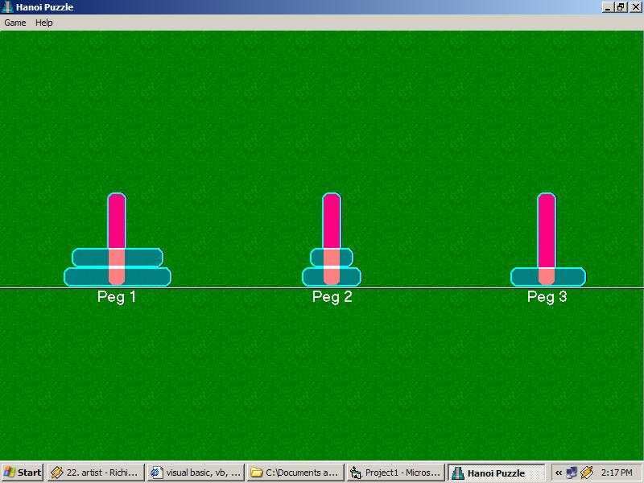

<div align="center">

## Hanoi Puzzle Game


</div>

### Description

strengthen your thinking skill
 
### More Info
 
try to move all disks from peg1 to peg3

there are two moving options, click-move and drag move, experience with them


<span>             |<span>
---                |---
**Submitted On**   |2002-11-30 14:22:04
**By**             |[Min Thant Sin](https://github.com/Planet-Source-Code/PSCIndex/blob/master/ByAuthor/min-thant-sin.md)
**Level**          |Advanced
**User Rating**    |4.7 (28 globes from 6 users)
**Compatibility**  |VB 6\.0
**Category**       |[Games](https://github.com/Planet-Source-Code/PSCIndex/blob/master/ByCategory/games__1-38.md)
**World**          |[Visual Basic](https://github.com/Planet-Source-Code/PSCIndex/blob/master/ByWorld/visual-basic.md)
**Archive File**   |[Hanoi\_Puzz15055011302002\.zip](https://github.com/Planet-Source-Code/min-thant-sin-hanoi-puzzle-game__1-41162/archive/master.zip)

### API Declarations

```
Type RECT
    Left As Long
    Top As Long
    Right As Long
    Bottom As Long
End Type
Public Type POINTAPI
   x As Long
   y As Long
End Type
Declare Function IntersectRect Lib "user32" (lpDestRect As RECT, lpSrc1Rect As RECT, lpSrc2Rect As RECT) As Long
Public Declare Function BitBlt Lib "gdi32" (ByVal hDestDC As Long, ByVal x As Long, ByVal y As Long, ByVal nWidth As Long, ByVal nHeight As Long, ByVal hSrcDC As Long, ByVal xSrc As Long, ByVal ySrc As Long, ByVal dwRop As Long) As Long
Public Declare Function CreateRectRgn Lib "gdi32" (ByVal X1 As Long, ByVal Y1 As Long, ByVal X2 As Long, ByVal Y2 As Long) As Long
Public Declare Function SetRectRgn Lib "gdi32" (ByVal hRgn As Long, ByVal X1 As Long, ByVal Y1 As Long, ByVal X2 As Long, ByVal Y2 As Long) As Long
Public Declare Function SelectClipRgn Lib "gdi32" (ByVal hdc As Long, ByVal hRgn As Long) As Long
Public Declare Function CombineRgn Lib "gdi32" (ByVal hDestRgn As Long, ByVal hSrcRgn1 As Long, ByVal hSrcRgn2 As Long, ByVal nCombineMode As Long) As Long
Public Declare Function DeleteObject Lib "gdi32" (ByVal hObject As Long) As Long
Public Declare Function GetPixel Lib "gdi32" (ByVal hdc As Long, ByVal x As Long, ByVal y As Long) As Long
Public Declare Function GetClientRect Lib "user32" (ByVal hwnd As Long, lpRect As RECT) As Long
```


